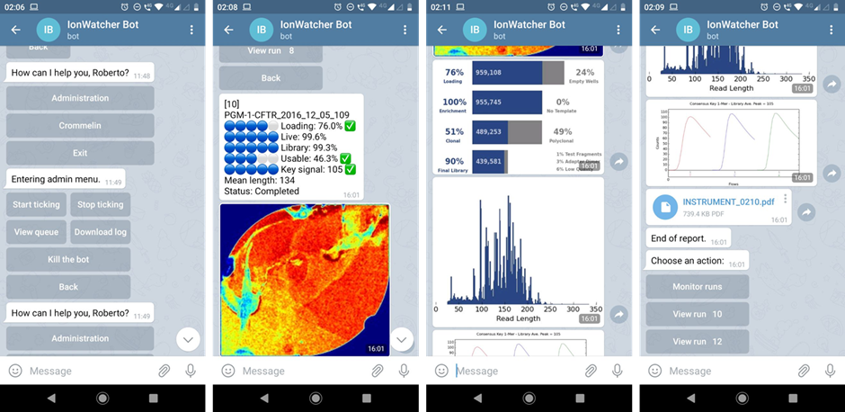

# README #

# What is IonWatcherBot #

IonWatcherBot is a simple [Telegram bot](https://core.telegram.org/bots) which, when connected to an [Ion Torrent](https://en.wikipedia.org/wiki/Ion_semiconductor_sequencing) Server via network, is able to fetch information about runs in progress and send it to trusted users, without exposing the Torrent Server itself outside the network.  

IonWatcherBot is currently in **early alpha version** (v0.1.0).  

Example screens:  

# How to install IonWatcherBot #

1 . Requisites:  

 * Python 3.5+ (I suggest [Anaconda Python](https://www.continuum.io/downloads))  
 * The [Beautiful Soup 4](https://www.crummy.com/software/BeautifulSoup/bs4/doc/) library (beautifulsoup4)  
 * The [Requests](http://docs.python-requests.org/en/master/) library (requests)  
 * The [Python Telegram Bot](https://github.com/python-telegram-bot/python-telegram-bot) library (python-telegram-bot).  
  
2 . Download or clone the source code for IonWatcherBot to a computer with Internet access and with network connection to the Torrent Server.  

3 . Within the Telegram app, [create a new bot](https://core.telegram.org/bots#creating-a-new-bot). In short:  

 * Start a chat with @BotFather  
 * Send the command `/newbot` to start creating the bot  
 * Choose a display name for the bot (i.e. "Ion Watcher")  
 * Choose a username for the bot (i.e. "IW05UH_bot")  
 * The BotFather will send you an Authorization Token. It's a unique identifier for the bot. Save this string, you will enter it on the bot's configuration file.  

4 . Personalize the `IonWatcher.cfg.EXAMPLE` file:  

 * rename or copy it to `IonWatcher.cfg`;  
 * on line 6, replace `aDdYoUrToKenHere:AskBotFatherForIt` with your bot's token;  
 * on line 8, replace `myserver.mydomain.edu` with your Torrent Server Browser address;  
 * if needed, replace the default server username on line 10;  
 * add your Telegram username as administrator on line 15, like this: `admins = MyTelegramUsername`.  

# Executing IonWatcherBot #

 * execute the script, e.g. from within the ionwatcherbot directory, type `python main.py` (or `python3` depending on your settings);  
 * enter the Torrent Server password.  

# Contacting the bot #

 * You **must** have a [Telegram username](https://telegram.org/faq#q-what-can-i-use-as-my-username) to contact the bot in a meaningful way.  
 * Start a chat with the username you chose for the bot (i.e. @ IW05UH_bot).  
 * Administrators have the right to approve or block an user that has asked to join the user queue, and to shut down the bot remotely via the command `/kill`.  
 * Administrators and approved users have the rights to monitor runs on the Torrent Server and to view the user queue (Telegram users awaiting approval as bot users).  
 * Users in the queue and blocked users have no available action.  
 * Unknown users can add themselves to the queue.  
  

# LICENSE #

**IonWatcherBot is offered under the GNU General Public License.**  
**Please read it here: https://www.gnu.org/copyleft/gpl.html**  

# FAQ #

**1 . Do you have any user/admin privileges on my bot?**  
A . No. The only approved users and admins are the ones listed on your bot's configuration file. This is why each lab has to register a new username for their bot with the @ BotFather; all IonWatcherBots share their functionality (`main.py`) but are individualized for approved users, admins and server and have a unique auth token (your own `IonWatcher.cfg`).  

**2 . Who can see my bot?**  
A. Telegram bots, just like any other user, can be searched by name or username. If this is a concern, I suggest choosing an incospicuous name and username.  
However, although the bot can be publicly contacted, it is designed to only offer information to approved users and admins. Of course, please report any deviation from this expected behavior.  

**3 . Can I shutdown the bot remotely?**  
A . Yes. As an administrator, send the `/kill` command to terminate the script.  

**4 . How can I edit the lists of approved users, admins and blocked usernames?**  
A . The only activity available remotely is the approval or block of Telegram usernames listed within the "queue".   
For security reasons, approval or removal of an admin is limited to manually editing the `IonWatcher.cfg` file from the computer hosting your IonWatcherBot.  
Removal of users from the approved list and removal of usernames from the blocked list will possibly be added to the online options later in time. For now, these lists must also be edited manually.  
When manually adding users to a list, please use commas `,` to separate usernames.  

**5 . Will the bot keep running if I close the terminal/command window after I successfully launched it?**  
A . Not *per se*; the bot would stop, but you can arrange on your own for it to keep running. On Linux, for example, you could use `screen` to run the bot without having to keep an active terminal:  
`cd` to the ionwatcherbot directory  
`screen python main.py`  
(input password)  
`CTRL-a d`  
(detached)  

To resume:  
`screen -r`  

**6 . Can I see who contacted my bot?**  
A. Yes, although partially at the moment. Every command received by the bot, whether accepted or not, is stored in the logfile along with the username that issued it (`IonWatcher.log`).  

**7 . Can I delete the logfile and the saved images/PDFs?**  
A . Yes, but please do not delete the `download` directory. The bot expects it to be there.  

**8 . How secure are messages and data sent to and from IonWatcherBot?**  
A . They are fairly secure. Although IonWatcherBot does not offer a layer of encryption itself, all data exchanged via Telegram follows Telegram's point-to-point [encryption protocol](https://telegram.org/faq#q-how-secure-is-telegram) which, at the moment this FAQ is being written, is based on the MTProto protocol.  
As an additional security measure, an optional PIN access control has been added on version 0.1.0. When PIN control is active, all users and admins will have to enter a PIN regularly to keep issuing commands. Please note, however, that this feature is only designed to stop a party having unauthorized access to a user's chat from issuing commands while the user is not actively using the bot. The strongest security feature of IonWatcherBot is the lack of access, by design, to sensitive sequencing data.  
